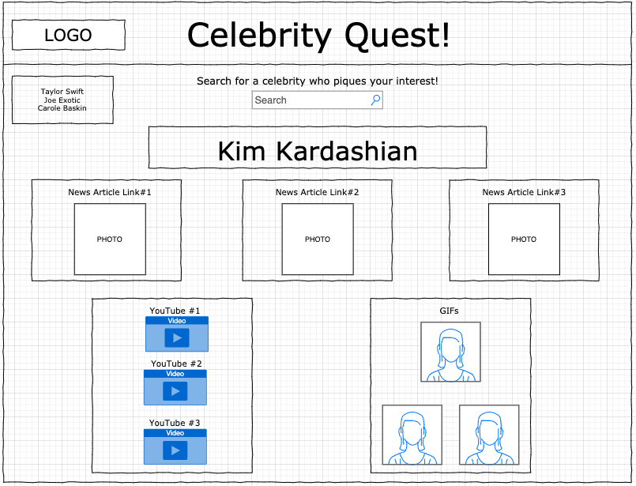

# Project-1

1. Purpose of the app: To be able to search for a celebrity and access several types of content related to that celebrity on one page, including YouTube videos, news articles, and gifs.

2. Team Members: Ashley Waldner, Melanie Jindali, Tashona Smith

3. Wireframe:

4. Link to GitHub Pages 
      https://uw-coding-bootcamp-project-1.github.io/Celebrity-Quest/